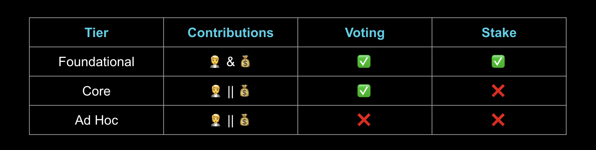
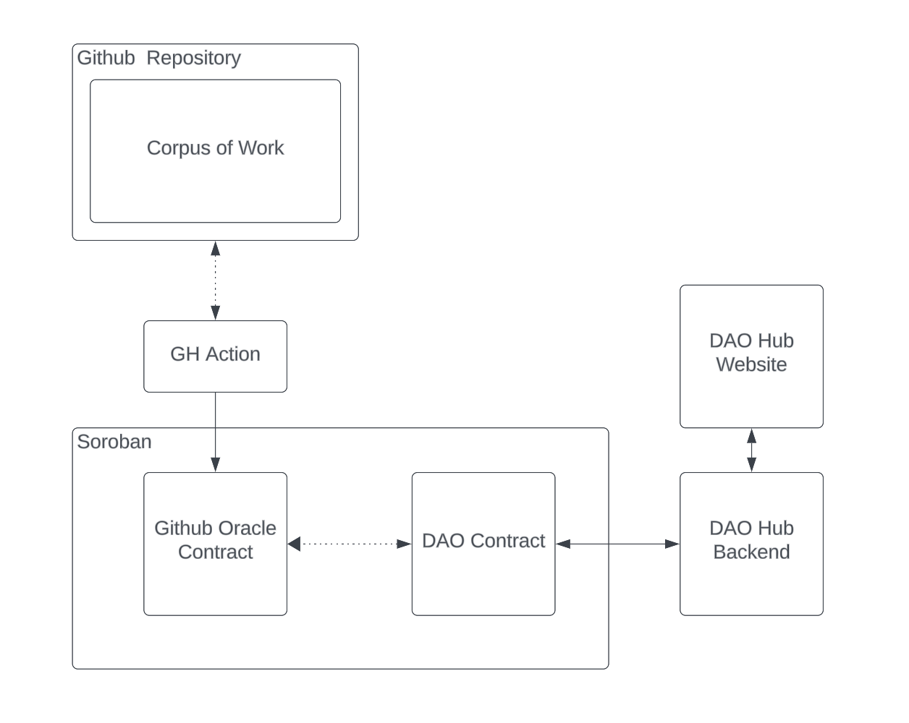
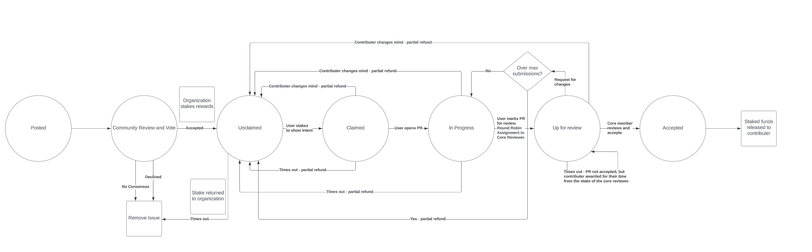

The Spaced Out Thoughts Development Foundation is evolving from an informal entity to a DAO ([a Decentralized Autonomous Organization](https://en.wikipedia.org/wiki/Decentralized_autonomous_organization)) in order to establish a self-sufficient, trustless organization with the goal of incentivizing development of [Digicus](https://spaced-out-thoughts-dev-foundation.github.io/digicus/), a platform to make **smart contract development as easy as possible**.

A DAO is an abstraction over a smart contract and a smart contract is _simply_ (a bit tongue in cheek, we know) a collection of functions autonomously executed in a VM running sidecar to a blockchain, operating on a shared set of data, maintained by the underlying network. Why consider a DAO over a traditional web2 organization? 

1. public visibility: *all actions, rules, etc. are in the open for anyone to read*
2. strong preference for as many nines as possible: *blockchains typically operate at an availability rarely seen in conventional tech, paramount for operational governance of an organization*
3. operating in a resource constrained environment is not an issue: *while we get (2), a tradeoff is we have to accept an exceptionally constrained execution environment in terms of resources, speed, etc.*
4. automated transfer of value: *we can leverage oracles to define goals, linking rewards to these goals, automatically transferring rewards upon successful completion*

***

## Functions

#### [Function 1]: Incentiviation of Work

Progress is not free. Thus, the primary purpose of this DAO is to incentivize work. We expect two *types* of contributors:

1. **core:** folks interested in ongoing work. These people will be _members_ of the DAO, have voting rights, and receive an ongoing _salary_ based on the value they provide (as voted on by their peers).
2. **ad hoc:** spontaneous workers. These folks will contribute when they have spare time, but not necessarily in a continuous or ongoing manner. 

Based on these two types of workers, funds will initially be allocated as follows: `75%` to core contributors and `25%` to ad hoc contributors. This _law_ will be codified.

In order to facilitate the distinction between core and ad hoc contributors _and_ in order to define tasks and criteria for completion, we will be leveraging a Github Oracle (_to be developed_).

#### [Function 2]: Prioritization of Funds

Since this work is open source, we expect four sources:

1. **core sponsorship**: angel/anonymous/supporter funding. This category of funding, while similar to (3), grants fractional voting rights similar to a board member in a traditional, stock based organization. 
2. **ad hoc sponsorship**: while this work is open source and free to use and free to fork, we are the subject matter experts and thus we are the ones most able to ship functional features in a reasonable timeframe. Thus, we will allow third parties to post *request for work* proposals. These will be very similar to how we post `ad hoc` work requests, except that the source of funding will come externally instead of out of the DAO's internal account.
3. **foundational sponsorship**: ongoing and future grants (i.e. [Stellar Community Fund](https://dashboard.communityfund.stellar.org/))
4. **fee for service**: it is often said that the creators of tooling, especially tooling that enables insight into the core functionality of a service, often have the best understanding of how those services work. We expect that over time we will develop Soroban expertise that we can lend out to the community for a fee (*consultation* work). A majority of fee for service rewards will go directly to the DAO member who handles the request, however a small percent will go back to the DAO to support further development.

Time and money are both limited. We will democratically decide:

* how to spend our capital (money and time)
* which ad hoc requests and fee for service requests to address in what order
* who is best to address these requests

***

## Membership

As noted, a DAO is supported by two resources: money and time. Based on how folks contribute and how much they contribute will define what privileges they receive.

<center></center>

***

## Tokenomics

**TBD**

***

## Operating Philosophy

1. Voting power is earned: *votes will be proportional to stake (time and money invested) with a preference for time*
2. We serve the greater good: *everything is public*
3. Optimize for developer happiness ([borrowed from the Rails Doctrine](https://rubyonrails.org/doctrine)): *when competing priorities arise, this is the tie breaker, "what will make our users happier?"*
4. Avoid flame wars at all costs: *we make technology and tool decisions based on group consensus and what is best for the job, avoiding basing purely on personal preference at all costs*

***

## Contract Design

As stated in the introduction, this is just an initial basic sketch. We fully expect the design to change as oru assumptions and understanding evolve. Furthermore, the source of truth is always the code. We will do our best to maintain this document, however, please always consult the code as well, especially for particular implementation details.

<center></center>

<br>
#### Components

**[Corpus of Work]**: a Github repository that functions as the source of truth for work. Here each instance of work will have a timeline, a set of well defined deliverables, and a reward (optionally we may assign to a user).
<br><br>
**[GH Action]**: maintains the state of the oracle contract
<br><br>
**[Github Oracle Contract**]: maintains the state of relevant Github information such as work, work progress, work details, etc.
<br><br>
**[DAO Contract]**: leveraging the oracle, facilitates voting, proposals for new work, reward distribution, etc.
<br><br>
**[DAO Hub Backend]**: surfaces information from the DAO contract to be consumed by other services. Likely will also include the hosting a Horizon and a Soroban RPC service as well.
<br><br>
**[DAO Hub Website]**: a visual of the pertinent information from the DAO contract. Will have basic functionality to interact with the contract as well.

***

## Decentralized Oracle Network

An oracle:
> Oracles are applications that produce data feeds that make off-chain data sources available to the blockchain for smart contracts... [w]ithout an oracle, a smart contract would be limited entirely to on-chain data. Oracles differ based on the source of data (one or multiple sources), trust models (centralized or decentralized), and system architecture (immediate-read, publish-subscribe, and request-response). We can also distinguish between oracles based on whether they retrieve external data for use by on-chain contracts (input oracles), send information from the blockchain to the off-chain applications (output oracles), or perform computational tasks off-chain (computational oracles)... [s]ince information stored on-chain is unalterable and publicly available, Ethereum nodes can safely use the oracle imported off-chain data to compute state changes without breaking consensus... [t]o do this, an oracle is typically made up of a smart contract running on-chain and some off-chain components. The on-chain contract receives requests for data from other smart contracts, which it passes to the off-chain component (called an oracle node). This oracle node can query data sources—using application programming interfaces (APIs), for example—and send transactions to store the requested data in the smart contract's storage.
> -- Ethereum.org (https://ethereum.org/en/developers/docs/oracles/)

A smart contract is 


A blockchain is essentially a closed network. Oracles allow info to flow in and out of the network from a trusted source - folks decide which Oracles to trust.

To design an oracle,

<center></center>

### Sub Goals
* **Cheap**: some folks may wish to operate with minimal resources. It should be possible to operate on a minimal raspberry pi


Oracle Design pattern: _pub-sub_


Decentralized oracle:
* correctness
  * authenticity proof
  * consensus
  * Voting & staking
* Schelling point? (chain link does this)
* Reputation of correctness based on past historical performance

Best Source


#### What we want it to do

Synchronize critical github issue information.

States of an issue.

1. initially posted (lock funds to issue)
2. unclaimed
3. claimed (someone staked and attached github to some address)
4. started (PR opened linking PR)
5. ready for review
6. accepted (will trigger release of funds)
7. [misc. path] timed out, released (but stake not released. Dev gets less back in refund if they give up based on time)

Connecting Github and Stellar

[Organization]:
  * Data
    * Stellar Address
    * Github handle
    * Domain
  * Github side
    * Proof posted in oracle repo (signed data with username using public key)
  * Stellar side
    * Proof posted in contract along with mapping
  * Domain side
    * Manifest

**Github Side**
```
organizations:
  - name: "Spaced Out Thoughts Development Foundation"
    website: "https://spaced-out-thoughts-dev-foundation.github.io/"
    proof: "TBD"
    github_name: "robertDurst"
    public_key: "GD5I4NMCQLYS464YS6ANTI55JLLPO6PPL4KYHP3YKBJ4B7R7MPVQK7IM"
```

Proof Algorithm
[library]: https://github.com/spaced-out-thoughts-dev-foundation/github-soroban-proof-generator
[Pseudocode]:
```
LINK_TO_ORG = initial SHA of proof-less verified PR to organization repository
LINK_TO_MANIFEST = manifest url from their domain
PROOF = sign_with_stellar_key(LINK_TO_ORG & GITHUB_USERNAME & LINK_TO_MANIFEST)
```

[User]:
  * Data
    * Stellar Address
    * Github handle
  * Github side
    * Proof posted in oracle repo (signed data with username using public key)
  * Stellar side
    * Proof posted in contract along with mapping

**Github Side**
```
users:
  - github_name: "robertDurst"
    proof: "TBD"
    public_key: "GD5I4NMCQLYS464YS6ANTI55JLLPO6PPL4KYHP3YKBJ4B7R7MPVQK7IM"
```

Proof Algorithm
[library]: https://github.com/spaced-out-thoughts-dev-foundation/github-soroban-proof-generator
[Pseudocode]:
```
LINK_TO_ORG = initial SHA of proof-less verified PR to organization repository
PROOF = sign_with_stellar_key(LINK_TO_ORG & GITHUB_USERNAME)
```


## Incentives

1. review code
2. put up code
3. run a node

## Things to Vote on

1. issues to prioritize
2. ecosystem proposals
3. core reviewer acceptance

## Reputation Score

* reviews
* contirbutions
* voting
* hosting a node


## Contract Actions

1. [Users] map github usernames to stellar addresses
2. [Repos] list of repos to sync
3. [Issues] per repo issue information
   1. [Github] Phase 
   2. [Github & Contract] If claimed, which account?
   3. [Contract] Stake
      1. Organization
      2. Contributor
      3. Reviewer

* CRUD user
* CRUD repo
* CRUD issue
* stake
  * post issue
    * stake
      * issue accepted
    * refund
      * issue times out
    * distribute to user
      * pull request accepted
  * claim issue
    * stake
      * issue claimed
    * refund
      * partial
        * times out
        * changes mind
        * too many submissions
  * review issue
    * stake
      * selected as reviewer
    * refund
      * submission fails
      * submission completed successfully
    * distribute to user
      * times out review